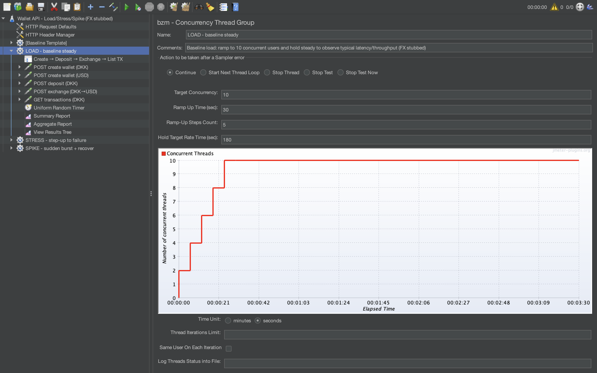

# Load test report (FX stubbed)

Evidence files:
- load_aggregate.csv (percentiles: 90/95/99)
- load_summary.csv (variability: Std. Dev.)

Thread Group settings (evidence):

Key takeaways:
- load_aggregate.csv: EXCHANGE is the main latency driver in the steady-load scenario (highest Average and 90/95/99% tail), so end-to-end speed under load is primarily constrained by the exchange operation.

- load_summary.csv: EXCHANGE also has the highest variability (largest Std. Dev. and Max), meaning response times are less predictable there even though Error% remains 0% in this run.