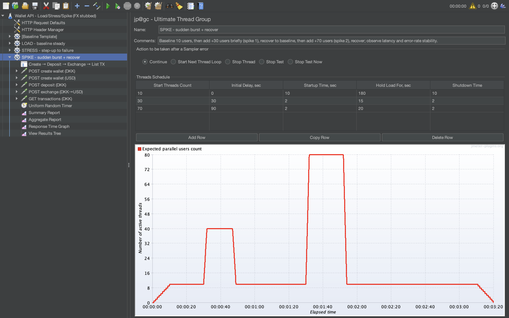

# Spike test – CSV notes (value)

## Files
- `spike_summary.csv` (Summary Report export)
- `spike_aggregate.csv` (Aggregate Report export)
- `spike_response_time_graph.png` (showcases response latency)

Thread Group settings (evidence):

## Key takeaways
- **spike_summary.csv:** Exchange is the main spike bottleneck (highest avg + highest 90/95/99% tail latency), so end-to-end latency under load is primarily driven by the exchange step (0% errors in this run).
- **spike_aggregate.csv:** Exchange is also the least predictable under spike (highest Std. Dev. and high Max), indicating jitter/tail-latency risk if concurrency increases further or the real external dependency is introduced.
