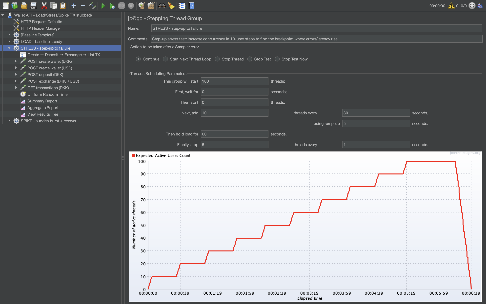

# Stress test report (FX stubbed)

Thread Group settings (evidence):

## stress_aggregate.csv (Summary Report / percentiles)
**Key takeaway:** Tail latency under stress is primarily driven by **POST exchange (DKK→USD)** (highest 90/95/99% lines), so end-to-end responsiveness will degrade first on the exchange step as concurrency increases (even with FX stubbed).

## stress_summary.csv (Aggregate Report / variability)
**Key takeaway:** A small but non-zero **Error% (~0.023% total)** plus large Max/Std.Dev. values indicates occasional slow/failing requests under stress; not critical at this level, but it shows where stability will start to break when pushing harder (exchange + deposit are the main candidates).